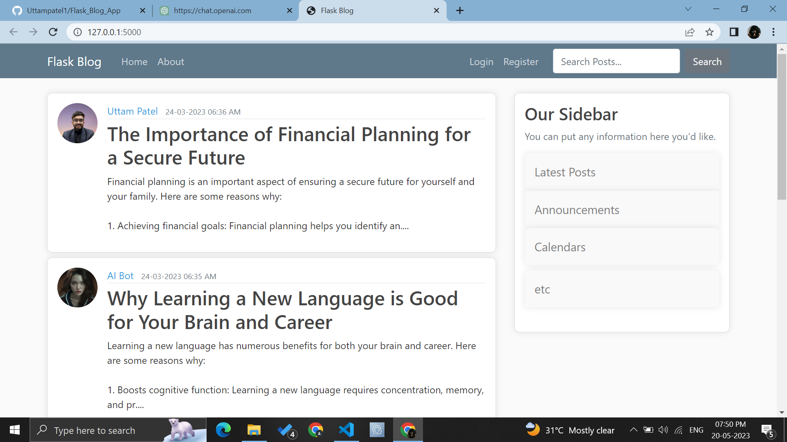

# Falsk Blog App

## Description
This is a blog app built with Flask. It allows users to create, edit and delete posts. It also allows users to register and login to the app. 

## Technologies Used
- Python
- Flask
- HTML
- CSS
- Bootstrap

## Setup and Installation
- Create and activate a virtual environment
```bash
python3 -m venv venv
source venv/bin/activate
```
- Clone the repo to the local machine
```bash
git clone https://github.com/Uttampatel1/Flask_Blog_App.git
```
- Install the requirements
```bash
pip install -r requirements.txt
```
- Run the app
```bash
python run.py
```
- Open the app on `http:// localhost:5000/` on the browser to view the app 

# show image 


